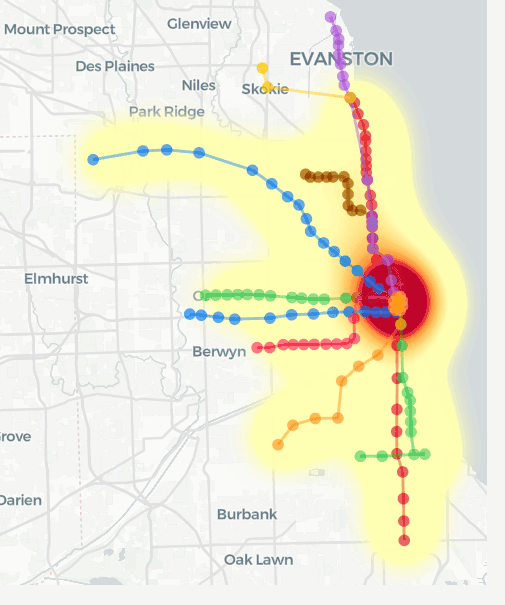

Pega **esto tal cual** en tu `README.md` (**sin** envolverlo en ` `):

---

# CTA Flowing Heatmap — Home → Work → Home (Network-Based Simulation)

This project generates a **time-evolving heatmap** over the Chicago CTA rail network.
Unlike a static density map, the “heat” in the GIF **moves along the train lines** to represent how commuters **propagate through the network** during the day.

## What you’re seeing in the GIF

* **Colored station dots + paths**: a simplified CTA rail network graph (each color is a CTA line).
* **Heat layer (yellow → red)**: estimated **passenger presence** near rail corridors at each time step.
* **Morning commute (AM)**: flow concentrates toward major job areas / downtown corridors.
* **Evening commute (PM)**: flow disperses outward as workers return home.

## Datasets used

### 1) CTA rail stops (stations + line membership)

* City of Chicago Data Portal: *CTA - System Information - List of 'L' Stops*
  [CTA - System Information - List of 'L' Stops (8pix-ypme)](https://data.cityofchicago.org/Transportation/CTA-System-Information-List-of-L-Stops/8pix-ypme)

### 2) Home ↔ Work job flows (Origin–Destination)

* U.S. Census LEHD: *LODES (Origin-Destination Employment Statistics)*
  [LEHD LODES Data](https://lehd.ces.census.gov/data/)
* LODES documentation / overview
  [LODES Overview / Code Samples](https://lehd.ces.census.gov/data/lehd-code-samples/sections/lodes.html)

## Core idea (formal model)

We transform Home–Work OD records into station-to-station flows, route them through the CTA graph, and convert routed flows into a continuous heat field.

### 1) Assign homes/jobs to the nearest CTA station

For a point $x$ (home or job) and stations $\mathcal{S}$:

$$
s^*(x)=\underset{s\in\mathcal{S}}{\operatorname{argmin}}; d(x,s),
\qquad
p(s\mid x)=\mathbf{1}!\left[s=s^*(x)\right].
$$

### 2) Aggregate station-to-station OD flow

Given OD records $(h,w)$ with weight $N_{hw}$ (e.g., `S000`):

$$
F_{ij}=\sum_{(h,w)} N_{hw}; p(i\mid h); p(j\mid w).
$$

### 3) Route flow through the CTA graph

On the network $G=(\mathcal{S},\mathcal{E})$, each edge $e$ has travel time:

$$
\tau_e=\frac{L_e}{v}+\tau_{\text{dwell}},
$$

and the route is the shortest-time path:

$$
P_{ij}=\underset{P:i\to j}{\operatorname{argmin}};\sum_{e\in P}\tau_e.
$$

### 4) Make the heat “flow” in time

We use a departure profile $g(t)$ (e.g., 15-minute bins) and shift flow along each path using cumulative edge travel times.
This yields edge presence $\Phi_e(t)$, which is then rendered as a continuous heat field.

### 5) Continuous heatmap (kernel density)

Sampling $R$ points along each edge:

$$
H(x,t)=\sum_{e\in\mathcal{E}} \Phi_e(t);
\frac{1}{R}\sum_{r=1}^R
\exp!\left(-\frac{\lVert x-x_{e,r}\rVert^2}{2\sigma^2}\right).
$$

## Assumptions (prototype)

* **All OD commuters use CTA rail** (upper-bound / illustrative simulation).
* The CTA network is a **simplified graph** (lightweight + editable; loop connections can be added manually).
* Routing uses **shortest travel time** on the graph.

## Output

* An **interactive map** (lonboard/deck.gl) with a time slider.
* Exportable **GIF/MP4** like the one shown above.

---

If you use this repo, please cite the City of Chicago Data Portal (CTA stops) and U.S. Census LEHD LODES for OD flows.

---
